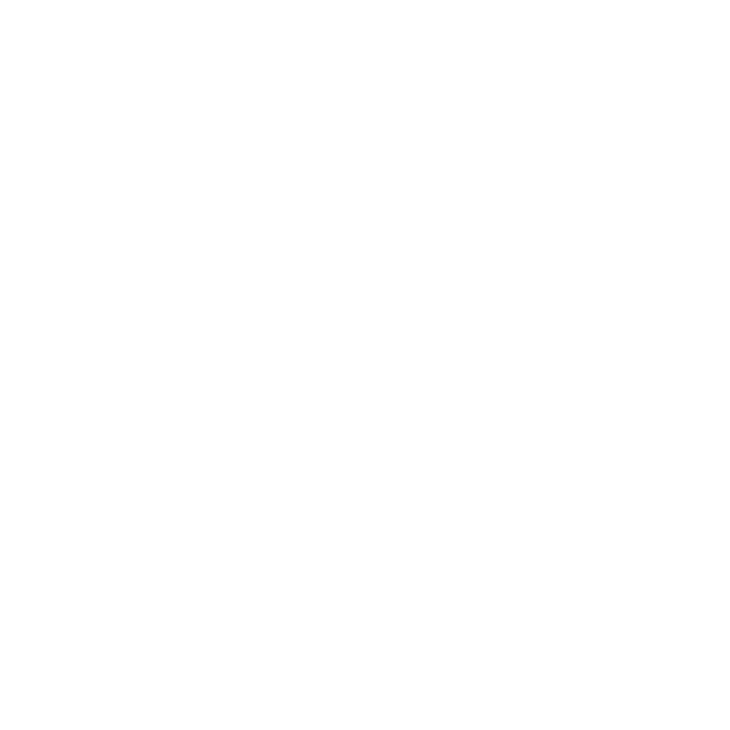
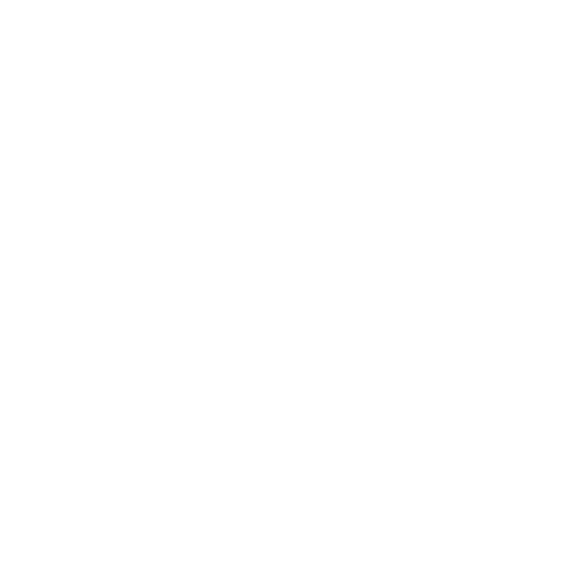

 <!-- Replace this with the path to your banner image -->

I'm a Software Developer with a passion for problem solving. Here on my GitHub profile, you can explore a variety of projects I've worked on and my contributions to open source.

# About Me

- 🔭 I’m currently working on [Skoola](https://github.com/villarley/skooladb) and [Stellar](https://github.com/KevinLatino/Stellar-Landing-Page).
- 🌱 I’m learning more about [Solidity](https://soliditylang.org/).
- 👯 I’m a web3 enthusiast.
- ⚡ Fun fact: I love coffee.

# Tech Stack

Here are some of the technologies and tools I work with:

## Backend

  
  
  
  
  
  
  
  
  
  
  

## 
Frontend

  
  
  
  
  
  
  
  
  

## 
Tools

  
  
  
<!--    -->
  
  

## 
DataBases

  
  
  
  
  

# 
GitHub Stats

# Contact

- **Twitter:** [@Villarley_](https://twitter.com/Villarley_)
- **LinkedIn:** [Santiago](https://linkedin.com/in/SantiagoVillarrealArley)
- **Email:** [santivillarley1010@gmail.com](mailto:santivillarley1010@gmail.com)

# Acknowledgements

A big thank you to everyone who has contributed to my projects and supported me on my development journey. 

---

Feel free to explore my projects and contributions. If you have any questions or would like to collaborate, don’t hesitate to reach out!
